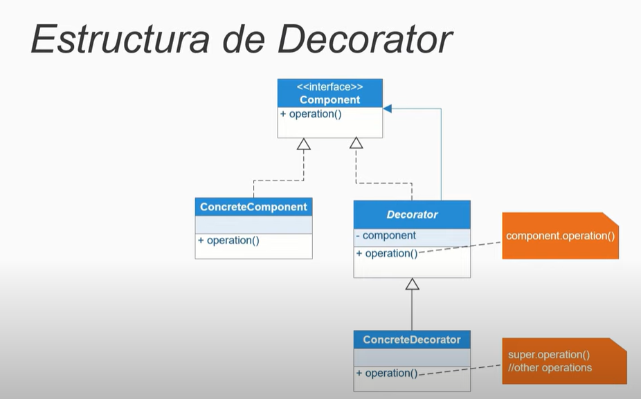
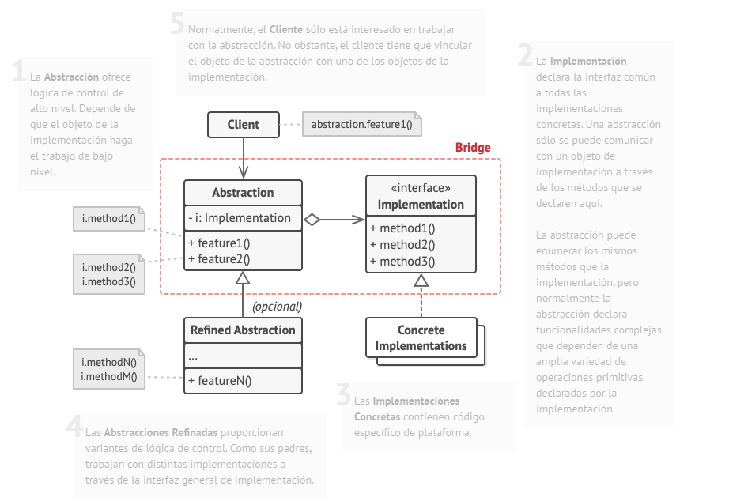

# DECORATOR:

Despues de creado un objeto agregarle metodos(decorarlo)
Sirve para mejorar, agregar funcionalidades extras a objetos 
es decir, tener un objeto y poder agregarle cosas.

**Definición:** El patrón Decorador permite añadir comportamiento adicional a un objeto dinámicamente sin alterar su estructura. Se usa para adherir responsabilidades a los objetos de forma flexible y extensible.

**Características:**

- **Flexibilidad:** Añade responsabilidades adicionales a los objetos en tiempo de ejecución.
- **Composición:** Usa la composición en lugar de la herencia para extender las funcionalidades.
- **Transparencia:** Los objetos decorados y no decorados pueden ser utilizados indistintamente.

**Componentes:**

1. **Componente:** Interfaz o clase abstracta que define el comportamiento básico.
2. **Componente Concreto:** Implementación de la interfaz Componente.
3. **Decorador:** Clase abstracta que implementa la interfaz Componente y contiene una referencia a un objeto Componente.
4. **Decorador Concreto:** Extiende la clase Decorador y añade comportamiento adicional.

# BRIDGE:

Este patron puede llegar a ser util aplicarlo tanto a un codigo con alto acoplamiento entre implementaciones-abstracciones, y tambien para iniciar un codigo limpio, mantenible y reusable desde el Inicio de su construccion.

Los componentes claves para llevarlo a cabo son: 
**Abstraccion:** Define las operaciones de alto nivel que los clientes pueden realizar. No contiene la implementación real, sino que delega las responsabilidades en una clase de implementación.
**Implementacion:** Contiene la lógica de negocio específica para realizar las operaciones definidas por la abstracción. Puede haber varias implementaciones concretas que hereden de la interfaz de abstracción.
**Reflejada/Referencia:** Establece la conexión entre la abstracción y la implementación. La abstracción mantiene una referencia a un objeto de implementación, permitiéndole llamar a sus métodos.

Algunos de sus casos de uso son por ejemplo: la creacion de Apps multiplataforma usando un codigo que pueda ser reutilizable en cada una de ellas. Tambien la conectividad a distintos sistemas externos sin necesidad de modificar el codigo de la aplicacion.

tomada de: https://refactoring.guru/es/design-patterns/bridge