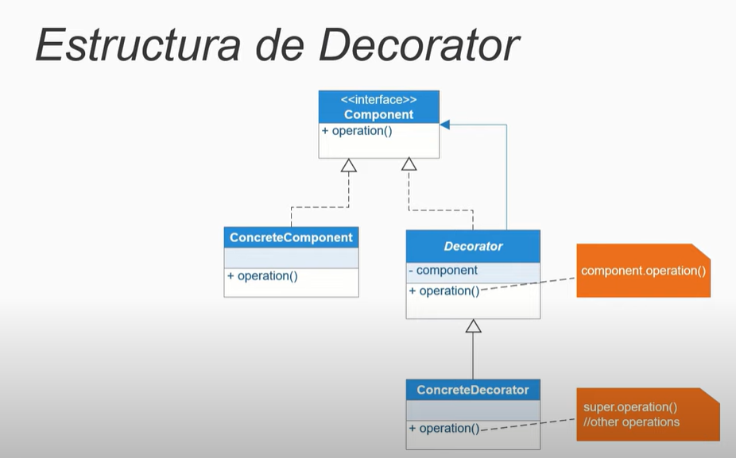

# DECORATOR:

Despues de creado un objeto agregarle metodos(decorarlo)
Sirve para mejorar, agregar funcionalidades extras a objetos 
es decir, tener un objeto y poder agregarle cosas.

**Definición:** El patrón Decorador permite añadir comportamiento adicional a un objeto dinámicamente sin alterar su estructura. Se usa para adherir responsabilidades a los objetos de forma flexible y extensible.

**Características:**

- **Flexibilidad:** Añade responsabilidades adicionales a los objetos en tiempo de ejecución.
- **Composición:** Usa la composición en lugar de la herencia para extender las funcionalidades.
- **Transparencia:** Los objetos decorados y no decorados pueden ser utilizados indistintamente.

**Componentes:**

1. **Componente:** Interfaz o clase abstracta que define el comportamiento básico.
2. **Componente Concreto:** Implementación de la interfaz Componente.
3. **Decorador:** Clase abstracta que implementa la interfaz Componente y contiene una referencia a un objeto Componente.
4. **Decorador Concreto:** Extiende la clase Decorador y añade comportamiento adicional.

